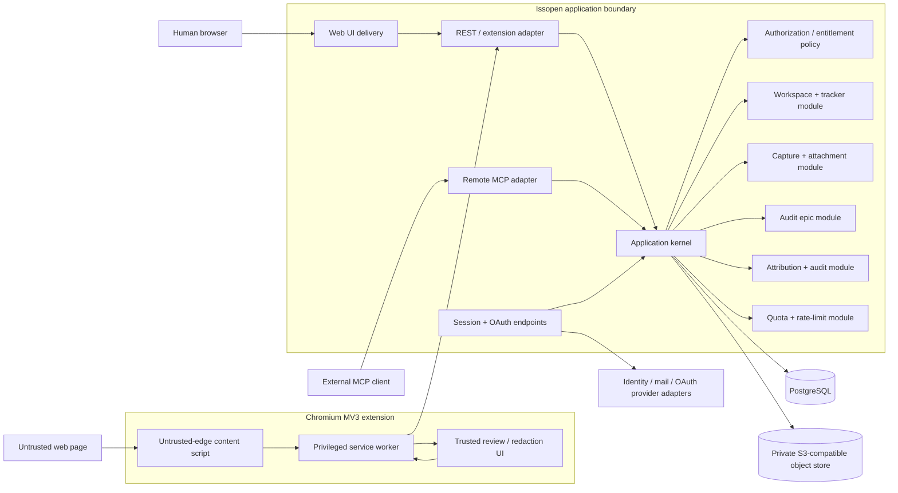

# Architecture Patterns

**Project:** Issopen
**Domain:** Open-source visual issue tracker for humans and external coding agents
**Researched:** 2026-08-23
**Overall confidence:** HIGH for component and trust boundaries; MEDIUM for the exact MCP client-compatibility envelope until tested against target clients

## Architectural Decision

Build Issopen as a **modular monolith with ports and adapters**, not as a set of
services. There should be one authoritative application kernel and one backend
deployable. The REST API, Remote MCP endpoint, browser extension endpoint and web
session adapter are merely different transports into the same application
commands and queries.

The minimum useful repository split is:

```text
apps/issopen/
├── apps/
│   ├── server/       # HTTP delivery, REST, auth/OAuth, MCP and modular monolith
│   ├── web/          # web UI; never owns authorization or persistence
│   └── extension/    # Chromium MV3 artifact
├── packages/
│   └── contracts/    # versioned wire schemas shared by the three clients
└── deploy/           # one product's deployment/configuration, not app-owned K8s
```

Do **not** start with `packages/db`, `packages/auth`, `packages/mcp`, `packages/shared`
or one package per domain noun. Keep server modules private to `apps/server` until
a second real consumer exists. `packages/contracts` is justified immediately
because web, extension and server must agree on public input/output schemas.

The web and server may be separate Node processes if the chosen web framework
requires it, but this is a delivery concern rather than a service boundary. The
web process must remain stateless and must not access PostgreSQL, object storage
or the identity provider directly. A simpler stack may serve the built web app
from the server and produce one application image. Both shapes preserve the same
boundary.

## Recommended System Shape



### Deployment Units

For Cloud and Community alike:

```text
reverse proxy / TLS
        |
        +-- issopen-app (web delivery + REST + OAuth endpoints + Remote MCP)
        |
        +-- PostgreSQL
        |
        +-- S3-compatible private object storage
```

The Chromium extension is a separately distributed client artifact. A database
migration command is a one-shot invocation of the same release, not a permanent
service. A background job runner can later be another command of the same image
for retention, orphan cleanup or webhook delivery; it must not become a second
business-logic implementation.

## Component Boundaries and Ownership

| Component | Owns | Must not own | Communicates with |
|---|---|---|---|
| Web UI | Rendering, board interaction, capture/activity presentation, same-origin REST client | Database queries, workspace authorization, signed-object policy | REST adapter only |
| REST/extension adapter | HTTP parsing, CSRF/CORS, session or bearer extraction, schema validation, response mapping | Workflow rules, tenant filtering decisions | Application commands/queries |
| Remote MCP adapter | Current MCP transport, tool schemas, OAuth challenges, protocol errors and response shaping | Separate issue logic, trust in client-supplied actor names, direct DB access | Same application commands/queries as REST |
| Auth endpoints/adapter | Human login, session lifecycle, MCP OAuth discovery/consent/token exchange, external identity mapping | Workspace role or project permission decisions | Identity provider port, grant store, policy layer |
| Authorization policy | Effective permissions from membership, credential scopes, project allowlist, autonomous-action policy, resource tenant and entitlement | Authentication protocol details | All application handlers |
| Workspace/tracker module | Workspaces, members, projects, board semantics, issues, comments, links and transitions | Browser capture mechanics or MCP framing | PostgreSQL, activity module |
| Capture/attachment module | Upload intents, private object keys, validation/finalization, visual context and signed reads | Public bucket access, raw browser credentials | Object-store port, PostgreSQL, limits |
| Audit epic module | Audit scope/categories, issue membership, computed progress, versioned summary | A second issue implementation or agent runtime | Tracker queries/commands, activity |
| Attribution/activity module | Immutable action facts and actor/delegation metadata | Event-sourced current state, secrets or full sensitive payloads | Same PostgreSQL transaction as mutation |
| Quota/rate-limit module | Reservations, usage counters, plan/instance policy and abuse controls | UI-only enforcement, hard-coded Cloud plan checks | PostgreSQL initially; replaceable limiter port |
| PostgreSQL adapter | Transactional state, tenant constraints, migrations, row-level defense | Files or authorization decisions in ad hoc SQL | Application repositories |
| Object-store adapter | Opaque private objects, signed exact-operation URLs, metadata/head/delete | Public ACLs, tenant authorization | Capture module only |
| Extension content script | Element picker and minimal structured extraction from the current page | Credentials, arbitrary network requests, issue creation, capture permission | Extension service worker via bounded messages |
| Extension service worker | Privileged Chrome calls, configured Issopen-origin fetches, short-lived auth state, capture orchestration | Long-lived in-memory workflow state, accepting arbitrary URL/headers from content scripts | Chrome APIs, review UI, REST adapter |
| Extension review UI | Preview, crop, destructive redaction and optional annotations | Hidden upload of the original image or raw DOM | Service worker only |

### Server Module Rule

Every state-changing handler follows one pipeline:

```text
transport input
  -> parse shared contract
  -> authenticate credential
  -> build immutable AuthContext
  -> authorize resource + action
  -> enforce rate/quota policy
  -> execute one database transaction
       -> lock/check version
       -> mutate state
       -> append audit event
       -> persist idempotency receipt
  -> map transport response
```

No REST route, MCP tool or server-rendered action may skip this pipeline.

## Domain and Data Boundaries

### Core Records

Use explicit records for responsibilities that are already v1 requirements:

```text
users / external_identities / sessions
workspaces / workspace_members
projects / board_columns
issues / comments / labels / issue_labels / issue_links
audit_epics / audit_epic_categories
attachments / upload_intents / visual_captures
agent_identities / authorization_grants / opaque_credentials
audit_events / command_receipts / usage_reservations
```

`AgentIdentity` is **not** a future-only table. Named identity, configurable
autonomy and full attribution cannot be satisfied by a generic personal token
plus a client-provided string. Add it immediately before the first MCP write.

An audit epic is a first-class aggregate with a project, declared scope,
categories, lifecycle and versioned human-editable summary. Issues retain their
ordinary workflow and may reference one audit epic and one category. Progress is
derived from the issues' semantic board categories; do not duplicate it as a
counter that can drift.

### Tenant Isolation

Every workspace-owned row carries `workspace_id`, including joins, attachment
metadata, grants, receipts and audit events. Project-owned records additionally
carry `project_id`. Enforce composite foreign keys such as
`(workspace_id, project_id)` and `(workspace_id, issue_id)` so a programming
mistake cannot connect records across tenants.

Isolation has three layers:

1. **Application policy:** repositories require an `AuthContext` and scope all
   queries by workspace before applying caller-supplied IDs.
2. **Database constraints:** composite keys and uniqueness rules reject
   cross-workspace references.
3. **PostgreSQL row-level security:** enable and force RLS on tenant tables as
   defense in depth; the runtime role must not own tables or have `BYPASSRLS`.
   Set request principal/workspace context transaction-locally so pooled
   connections cannot leak context.

PostgreSQL documents that RLS becomes default-deny when enabled with no
applicable policy, but table owners and `BYPASSRLS` roles normally bypass it.
That is why a separate migration-owner role and constrained runtime role are
mandatory, not optional hardening.

Never authorize from a URL slug, a hidden UI field or a supplied
`workspace_id`. Resolve the target resource, prove its tenant, then apply the
actor's membership and grant.

### Actor, Credential and Delegation Model

Keep authentication and attribution separate:

```text
human session
  -> user actor

extension OAuth grant
  -> user actor + source=extension + credential_id

MCP OAuth/PAT grant
  -> named agent_identity actor
  -> delegated_by_user_id
  -> credential_id / client_id
```

The effective permission for any action is the intersection of:

```text
workspace membership/role
∩ authorization-grant scopes
∩ project allowlist
∩ agent autonomy policy
∩ resource tenant
∩ instance/plan entitlement
```

Examples: `issues:write` alone cannot close an issue when `may_close=false`;
workspace admin status cannot let a token escape its project allowlist; a later
membership downgrade takes effect even if an access token has not expired.
Therefore every request performs a live grant/policy check after cryptographic
token validation.

Never use MCP `clientInfo`, a tool argument such as `agentName`, a User-Agent or
comment prose as authoritative actor identity. They are useful diagnostic
metadata only.

### State, Concurrency and Idempotency

- Allocate human issue numbers under a locked per-project counter and enforce
  `UNIQUE(project_id, number)`.
- Give mutable aggregates a monotonically increasing `version`. Commands accept
  `expectedVersion`; stale changes return a conflict containing current state.
- Every externally retryable write accepts a caller-generated `operationId`.
  Store a `command_receipt` uniquely by `(workspace_id, credential_id,
  operation_id)` with a normalized request hash and response reference.
- A replay with the same hash returns the recorded outcome. Reuse with different
  content returns `409 Conflict`. JSON-RPC request IDs are correlation IDs, not
  idempotency keys.
- Claiming, assigning and transitioning are compare-and-set operations. Two
  agents cannot silently claim the same issue or overwrite one another.
- State mutation, audit event and command receipt commit in one transaction.
  Audit events are not the state source; this is deliberately not event sourcing.
- Add a transactional outbox only when webhooks or asynchronous notifications
  exist. Do not introduce a broker for the MVP.

### Audit Event Contract

Every accepted command writes an append-only event containing:

```text
workspace_id, project_id?, entity_type, entity_id
action, actor_type, actor_id, delegated_by_user_id?
credential_id?, source(web|extension|mcp|api|system)
request_id, operation_id?, occurred_at
safe_before_after_summary, protocol/client diagnostic metadata
```

The runtime database role may insert and select audit events but not update or
delete them. Do not place bearer tokens, signed URLs, raw DOM, full attachment
names, authorization codes or sensitive issue bodies in event metadata. The
human activity feed is a projection of comments plus these immutable facts.

## Trust Boundaries

### Web Boundary

- Serve the web UI and REST API from the same site in the default deployment.
  Use `HttpOnly`, `Secure`, host-only, explicit `SameSite` session cookies.
- Protect every cookie-authenticated state change with an established CSRF
  mechanism and verify `Origin`/Fetch Metadata. `SameSite` alone is defense in
  depth, not the whole control.
- Keep CORS closed by default. Explicitly allow only configured Issopen web
  origins and published/unpacked extension origins where bearer endpoints need
  them; never combine wildcard origin with credentials.
- Apply a strict CSP and render user/DOM text as text. Do not use raw
  `innerHTML`/`dangerouslySetInnerHTML` for DOM excerpts, comments or Markdown.
- Treat page URLs, repository URLs, commit/PR links and webhook URLs as
  untrusted. Permit safe link schemes and use safe outbound-link attributes.
  The server must not fetch a captured page URL or repository link; doing so
  would create SSRF from untrusted issue content.
- Never make a `GET` mutate state. Bound request bodies, pagination and search
  cost before domain execution.

### Chromium MV3 Boundary

Chrome's official documentation says `activeTab` grants temporary access after
an explicit user gesture and avoids permanent `<all_urls>` access. Use exactly:

```text
required: activeTab, scripting, storage, identity
optional host permission: the configured Issopen instance origin
not requested: tabs, webRequest, cookies, history, <all_urls>, unlimitedStorage
```

`captureVisibleTab()` can capture the visible area with `activeTab`; it can also
capture some otherwise sensitive schemes. Issopen must impose its own stricter
rule: capture only explicit `http:` and `https:` pages, reject `chrome:`,
`chrome-extension:`, `file:`, `data:` and incognito by default.

The three extension contexts have different trust:

1. **Content script — page-adjacent and untrusted.** It runs in an isolated JS
   world, but Chrome explicitly notes that it shares the DOM with the host page
   and a hostile page can manipulate what it sees. Its only jobs are highlight,
   selection and bounded extraction.
2. **Service worker — privileged coordinator.** It validates sender, tab,
   message discriminant, sizes and values; captures the tab; and calls only the
   preconfigured Issopen origin. It never accepts an arbitrary destination URL,
   HTTP method or header from the content script.
3. **Extension page/side panel — trusted review UI.** It receives a bounded
   capture draft, lets the user remove data and creates the final upload bytes.
   Do not place this UI inside the inspected page.

MV3 service workers may be terminated after inactivity and lose globals. Model
capture as a resumable state machine with an explicit draft ID and store only
the minimum draft state needed. Keep access tokens in `chrome.storage.session`,
which Chrome recommends for sensitive data and does not expose to content
scripts by default. Persist only non-secret instance URL, project preference and
draft metadata in `storage.local`, with access set to `TRUSTED_CONTEXTS`.
Extension storage is not encrypted, so a long-lived bearer or refresh token must
not be treated as safely stored there. Prefer short-lived access plus interactive
reauthorization or a browser/OS-backed provider flow; if persistence is later
required, document the local-profile compromise risk and rotate the refresh
credential.

Use `chrome.identity.launchWebAuthFlow()` with authorization code + PKCE for the
extension login. The service worker, not the content script, owns the verifier
and exchanges the returned code.

### DOM Minimization and Sanitization

Do not capture HTML and then attempt to clean it. Construct a new, bounded,
structured representation from an allowlist:

```json
{
  "tag": "button",
  "role": "button",
  "testId": "submit-order",
  "stableId": "submit",
  "classes": ["submit-order"],
  "textExcerpt": "Place order",
  "selector": "[data-testid=submit-order]",
  "rect": {"x": 0.42, "y": 0.31, "w": 0.18, "h": 0.08},
  "ancestors": [{"tag": "form", "role": "form"}]
}
```

Rules enforced in both extension and server schema:

- fixed maximum depth, node count, attributes, strings and total serialized
  bytes;
- no scripts, styles, event-handler attributes, arbitrary `data-*`, comments,
  shadow-root dumps or full DOM;
- no values from `input`, `textarea`, `select`, `option`, `contenteditable`,
  password/payment fields, hidden nodes or storage/cookies/network;
- allow only selected semantic attributes; reject URLs and attributes matching
  credential/token patterns; normalize control characters;
- strip URL username/password, fragment and sensitive query parameters; default
  the transmitted page location to origin + path, with user review before any
  query string is kept;
- render the result as escaped text/structured fields, never executable HTML.

Regex redaction is only a backstop, not proof of safety. The user preview and
removal step remains mandatory. A screenshot redaction must be **destructively
rasterized before upload**. Storing an original image with a removable overlay
does not hide the secret.

### Storage Boundary

- Use a private S3-compatible bucket through an application-owned storage port.
  Domain code knows opaque object IDs, not provider URLs or Supabase objects.
- Object keys are random and write-once; tenant prefixes aid operations but are
  not authorization.
- Create an upload intent only after membership, scope, rate and quota checks.
  Sign one exact key, operation, MIME/size constraint and short expiration.
- After upload, the client finalizes the intent. The server checks object
  existence, actual size, magic bytes, image dimensions and allowed type before
  atomically linking attachment/capture/issue. Unfinalized objects are
  quarantined and garbage-collected.
- Initially allow raster images for inline visual captures. Force untrusted
  SVG/HTML and other active formats to download or reject them. Add malware
  scanning before broad document support.
- An attachment read first authorizes the current actor against its workspace
  and issue, then returns a single-object, short-lived signed URL or an
  authenticated streaming response. Send private/no-store caching and safe
  content disposition. Never expose a bucket, list operation or reusable prefix.
- Signed URLs are bearer capabilities: keep their lifetime to minutes, avoid
  logs, and mint only after the read decision. Revoking workspace access stops
  new URLs; very short expiry limits an already minted URL.

## End-to-End Data and Trust Flows

### 1. Manual Issue

```text
Web -> REST: CreateIssue(contract, operationId)
REST -> Auth: validate session + CSRF/origin
REST -> Policy: membership + project + issues:create
Kernel transaction:
  lock project counter
  allocate issue number
  insert issue
  append created audit event (human actor, source=web)
  store command receipt
REST -> Web: issue DTO + version
```

All later edit/comment/transition calls send `expectedVersion` where applicable.
The board uses the column's semantic category for agent logic, never its editable
display name.

### 2. Visual Capture

```text
explicit user gesture
  -> activeTab grant
  -> service worker injects picker
  -> content script returns bounded structured element context
  -> service worker captures visible tab
  -> trusted extension UI crops, previews and destructively redacts
  -> REST creates scoped upload intent + reserves quota
  -> extension uploads final raster directly to exact private object key
  -> REST finalize verifies object and executes CreateVisualIssue transaction
  -> issue + attachment + visual_capture + audit event + receipt commit together
  -> board opens created issue
```

The original screenshot, raw DOM and removed text never leave the extension.
If finalization fails, the object remains unattached/quarantined and cleanup
releases its reservation. Repeating the same `operationId` cannot create a
second issue.

### 3. Audit Epic

```text
human creates audit epic(scope, categories)
  -> ordinary authorization/idempotent command + audit event
human or authorized agent creates/fetches issues with epic_id + category_id
  -> policy proves same workspace and project
  -> normal issue command; no special DB patch path
query epic
  -> joins issue semantic statuses
  -> computes totals/progress/responsible actor mix
human/authorized agent updates versioned summary
  -> attributed event with safe diff
```

Agent-created findings use the agent grant's real project and creation scopes.
An epic does not broaden them. “Audit all projects” is multiple explicitly
authorized project calls, not implicit workspace-wide access.

### 4. MCP Authorization

For a protected Remote MCP server, use the current MCP authorization profile,
not a bespoke token page as the primary connection flow:

```text
client -> POST /mcp without token
server -> 401 WWW-Authenticate with RFC 9728 resource_metadata + minimal scope
client -> protected-resource metadata -> authorization-server discovery
client -> authorization code flow with PKCE and resource=<canonical MCP URL>
user -> login + consent UI
consent -> choose/name agent, workspace, projects, scopes, autonomy bounds
server -> create AgentIdentity + AuthorizationGrant
authorization server -> short-lived, audience-bound access token
client -> POST /mcp with Authorization: Bearer ...
MCP adapter -> validate issuer/audience/expiry/scopes, then live grant policy
```

The current 2026-07-28 MCP specification uses stateless Streamable HTTP: each
message is a POST to one endpoint; no protocol session or standalone GET stream
is required. Use the official SDK's compatibility path if real target clients
still speak 2025-era transports. Do not hand-roll two servers.

The MCP endpoint must validate every present `Origin` against configuration, as
the transport specification requires to prevent DNS rebinding. Non-browser CLI
clients may omit `Origin`, but still require authentication. Validate mirrored
`Mcp-Method`/`Mcp-Name` headers against the body before using them for policy or
rate limiting.

Use Client ID Metadata Documents or pre-registration for supported clients.
Dynamic Client Registration is deprecated in the 2026-07-28 release. Any remote
metadata fetch needs SSRF controls, HTTPS, response/redirect limits and exact
redirect-URI validation.

**Inference:** because Issopen's MCP surface is entirely private and must be
interoperable, a manually pasted PAT alone is not an acceptable primary Remote
MCP authentication design. A hashed, revocable PAT may remain as an explicit
Community/automation compatibility option, but it must bind to the same
AgentIdentity, project allowlist, scopes and autonomy policy and does not replace
OAuth discovery.

Credential lifecycle is server-owned:

- OAuth access tokens are short lived and include/resolve issuer, subject,
  audience, grant and scopes. Refresh credentials are rotated on use; reuse
  revokes the credential family. Whether access tokens are signed or opaque is
  an auth-adapter choice, but the resource server always validates audience and
  consults the live grant.
- A compatibility PAT is at least 256 bits of randomness, displayed once and
  split into a public lookup ID plus secret. Store only a keyed hash of the
  secret, compare in constant time, and keep scopes, project allowlist, agent,
  expiry and revocation as server-side grant data. Never make the human-readable
  token name authoritative.
- Bearers travel only in the `Authorization` header over HTTPS, never in URLs,
  tool arguments, issue fields or logs. Logout/revoke, membership removal,
  workspace deletion and autonomy reduction invalidate or reduce the grant
  immediately; short token expiry limits cached verifier state.
- Update `last_used_at` and coarse client diagnostics without making the hot path
  depend on a best-effort activity timestamp. Authentication failures are
  rate-limited and logged without the presented secret.

### 5. MCP Read and Write

```text
MCP tools/call
  -> protocol + JSON schema validation
  -> AuthContext from verified credential (never from tool arguments)
  -> same ListIssues/GetIssue/AddComment/Claim/Transition commands as REST
  -> tenant/project/scope/autonomy/rate checks
  -> version/idempotency transaction for writes
  -> attributed audit event
  -> bounded MCP result
```

Keep the tool surface small. Read tools return attachment metadata, sanitized
visual context and a separately authorized attachment-access action; they do not
inline base64 images. Write tools expose named supported fields only. Include
`operationId` and `expectedVersion` in write inputs and return actionable
conflict/forbidden results.

The initial OAuth consent should request only discovery/read scopes. Challenge
for write/attachment scopes when required. The current MCP profile defines
scope challenges and step-up; broad `issues:*` up front increases compromise
impact and weakens intent in the audit trail.

### 6. Attachment Read

```text
web/MCP requests attachment metadata or access
  -> credential validation
  -> attachment -> issue -> workspace resolution
  -> membership + project + attachments:read
  -> rate check
  -> exact short-lived signed GET or authenticated stream
  -> access-issued audit/metric without logging the signed URL
```

An attachment ID is not a secret and a storage prefix is not a tenant boundary.
Authorization always precedes signing.

### 7. Attribution

```text
credential -> server-authenticated actor/delegation
command -> immutable request context
transaction -> current-state mutation + audit event
query -> activity DTO combining events/comments
```

Client-reported branch, commit and PR links remain unverified links in v1. Mark
their source actor and do not describe them as GitHub-verified until a future
GitHub App verifies them.

### 8. Community Self-Host

```text
operator sets public URLs, DB, object store, auth providers and SMTP
  -> one-shot migration with owner credential
  -> app starts with constrained runtime DB credential
  -> readiness verifies schema/DB/store; liveness checks process only
  -> reverse proxy terminates HTTPS for web, API and /mcp
  -> extension reads configured /.well-known/issopen instance metadata
  -> user grants optional host permission and authorizes normally
```

Provide Docker Compose with the app, PostgreSQL and an S3-compatible store; an
external PostgreSQL/object store/identity provider can replace each container by
configuration. Secrets enter via environment/secret mounts, never the image or
repository. Telemetry is off by default. Backup/restore must cover PostgreSQL
and the object bucket as one logical product.

`/.well-known/issopen` is a recommended Issopen-specific discovery document,
not an existing standard. It should publish only public instance ID, web/API/MCP
URLs, OAuth resource/issuer hints, upload limits and supported features—never
plan secrets or internal endpoints.

## Cloud and Community Configuration Seams

Cloud and Community run the **same migrations, domain modules, API contracts,
MCP tools and extension**. Differences enter only through ports/configuration:

| Seam | Community default | Cloud implementation | Invariant |
|---|---|---|---|
| PostgreSQL | Compose or external PostgreSQL | Managed PostgreSQL | Same schema/migrations/RLS |
| Object storage | S3-compatible local/external | Managed S3-compatible service | Same private-object port and key model |
| Human identity | Configured GitHub/email provider | Managed provider | Internal user IDs and authorization remain Issopen-owned |
| MCP authorization server | Integrated standards-compliant routes/provider adapter | Same routes, optionally external issuer | Same grants/scopes/audience checks |
| Email | SMTP | Managed mail adapter | Same invite/magic-link application contract |
| Entitlements | Safe configurable defaults, possibly unlimited | Stored plan limits | API policy is authoritative; UI only presents it |
| Rate limiting | PostgreSQL-backed safe defaults | Same plus trusted edge/distributed adapter | Domain operation limits still enforced in app |
| Observability | Structured logs, opt-in exporters | Managed exporters | No Cloud SDK in domain code |
| Public origin | Operator configured | Issopen-managed domain | Explicit trusted-proxy/origin configuration |

Do not import Supabase-specific auth/storage clients into web, extension or
domain modules. If a managed Cloud provider is chosen, isolate it behind the
PostgreSQL, object-store or identity adapters. Do not branch on
`if (edition === "cloud")` throughout handlers; resolve an entitlement policy
once and pass its decisions through the standard authorization pipeline.

**Inference:** maintaining the Community Compose path from the first runnable
slice is cheaper and safer than “adding self-hosting later.” The release-quality
docs can come later, but CI must continuously run the same migrations and core
flow against generic PostgreSQL and S3-compatible storage to detect SaaS lock-in.

## Rate Limits, Quotas and Abuse Controls

Use separate limits because their costs and threats differ:

| Surface | Primary key | Control |
|---|---|---|
| Login/OAuth callbacks/token exchange | IP + client + account | burst limit, replay/state/PKCE checks, generic errors |
| REST/MCP reads | credential + workspace + operation | request and result-size/page limits |
| REST/MCP writes | credential + workspace + command | rate limit, idempotency, optimistic concurrency |
| Capture upload intent | credential + workspace | capture/month quota, concurrent intents, bytes reservation |
| Signed attachment reads | credential + object | rate/bandwidth limit and short TTL |
| Search/list | credential + project | bounded filters, cursor pagination, maximum scan/result |

Start with PostgreSQL-backed buckets/reservations so multiple app replicas agree;
an in-memory limiter is only an additional per-process fuse. Cloud may add edge
IP limiting or a distributed limiter later, but neither replaces authoritative
transactional quotas. Return `429` with `Retry-After`; use `403` for permission
and `409` for idempotency/version conflicts.

Storage quota is reserved before signing and reconciled against actual finalized
bytes. Failed/expired upload intents release reservations. Reaching a quota
blocks the expensive new action, not reads, comments, export or deletion of
existing data.

## Patterns to Follow

### Pattern 1: One Use Case, Many Adapters

**What:** REST and MCP translate into the same typed application request.

```typescript
type AuthContext = {
  actor: { kind: "human" | "agent"; id: string };
  delegatedByUserId?: string;
  credentialId: string;
  workspaceIds: readonly string[];
  scopes: ReadonlySet<string>;
  projectAllowlist: ReadonlySet<string>;
  autonomy: { mayCreate: boolean; mayClaim: boolean; mayClose: boolean };
  source: "web" | "extension" | "mcp" | "api";
  requestId: string;
};

await commands.transitionIssue(authContext, {
  issueId,
  targetSemanticStatus,
  expectedVersion,
  operationId,
});
```

The example is architectural pseudocode, not a stack commitment.

### Pattern 2: Private Upload Intent → Finalization

**What:** authorize and reserve first, upload directly, verify and link later.

**Why:** avoids routing large files through the app while keeping quota,
privacy and issue creation authoritative.

### Pattern 3: Append Audit in the Mutation Transaction

**What:** every mutation and its audit fact commit together.

**Why:** a delayed best-effort log cannot satisfy full attribution. This gives
strong provenance without making events the source of current issue state.

### Pattern 4: Denormalized Tenant Key + Composite Integrity

**What:** repeat `workspace_id` on tenant records and enforce composite foreign
keys, application scoping and RLS.

**Why:** a little duplication provides a local tenant invariant and makes both
queries and denial tests explicit.

## Anti-Patterns to Avoid

### Separate MCP Business Logic

**Why bad:** permissions, transitions and audit behavior drift between humans
and agents. The MCP adapter must call the same handlers.

### Broad Extension Host Access

**Why bad:** permanent `<all_urls>`, `tabs`, network or cookie permissions turn
a focused reporter into a high-value browser surveillance target. Use a user
gesture, `activeTab` and optional Issopen-origin permission.

### “Sanitize Later” DOM Capture

**Why bad:** once raw DOM or the original screenshot reaches logs, storage or
server memory, preview/redaction can no longer restore the promised privacy.
Minimize and destructively redact before upload, then validate again server-side.

### Public or Guessable Attachment URLs

**Why bad:** obscurity and tenant-prefixed object keys are not authorization.
Keep objects private and mint exact, expiring capabilities after access checks.

### RLS Through the Table Owner

**Why bad:** PostgreSQL owners normally bypass RLS. A runtime owner makes a
supposed defense disappear. Separate owner/migration and runtime roles and force
RLS.

### Actor Identity From Token Label or MCP Metadata

**Why bad:** an agent can rename itself “Luis” or “Security Reviewer.” Actor
identity comes from the server-side grant; client metadata is only diagnostic.

### Overlay-Only Redaction

**Why bad:** the original pixels remain recoverable. Flatten redactions into the
only uploaded visual asset.

### Cloud Provider APIs in Core Modules

**Why bad:** it makes the Community edition a later rewrite. PostgreSQL, S3,
OIDC/OAuth and SMTP boundaries keep the same product deployable everywhere.

## Dependency-Driven Build Order

This ordering intentionally does not follow the brief's phase numbering. It
validates the complete visual-to-agent loop as early as its security dependencies
allow.

### 1. Runnable Skeleton + Identity/Tenant Proof

Deliver one app process, shared contracts, migrations, local Compose,
authentication adapter, personal workspace creation and an automated two-user
cross-workspace denial test. Establish separate DB owner/runtime roles and RLS
now. Keep generic PostgreSQL/object-store configuration in CI from this point.

**Vertical proof:** two real users authenticate; neither can read the other's
workspace through an ID substitution.

### 2. Manual Tracker Slice + Transactional Attribution

Deliver project, semantic columns, create/read issue, minimal board/detail,
comment and transition. Add operation receipts, versions and transactional audit
events from the first write. Repository URL and explicit result links are cheap
context and can be included here.

**Vertical proof:** a human creates, moves, comments and reviews a persistent
issue; the activity feed proves who did each action.

### 3. Private Visual-Context Pipeline Through the Web

Deliver upload intent/finalization, S3-compatible private storage, image
validation, signed authorized reads, quota reservations and a manual web image
attachment. Do this before the extension so storage security can be tested with
ordinary HTTP tooling.

**Vertical proof:** workspace A uploads and views an image; workspace B cannot
read it even with the attachment/object ID; retries create one attachment.

### 4. Minimal Extension Visual Report

Deliver MV3 service worker, `activeTab`, visible-tab capture, trusted preview,
destructive redaction, configurable instance authorization, project selection,
one visual-issue submission and useful bounded element context. A rectangle or
text annotation may follow once the privacy-critical path works.

**Vertical proof:** on a real hostile/test page, one explicit gesture produces
one safe issue with final screenshot, URL and selected-element context; raw DOM,
form values and original redacted pixels never reach the server.

### 5. One Complete Remote MCP Agent Loop

Deliver current Streamable HTTP through the official SDK, OAuth protected
resource discovery/consent, AgentIdentity/grants, project allowlists, minimal
read/list/get plus claim/comment/transition tools, idempotency, version conflicts
and attributed activity. Implement read and write in the same phase; read-only
MCP does not validate the core thesis.

**Vertical proof:** two real target MCP clients authorize with least privilege;
an external agent reads the visual issue, claims it, comments, links a result
and moves it to review; a human closes it. A token from another audience/project
is denied.

**Research flag:** current client support for the breaking MCP 2026-07-28
revision and Client ID Metadata Documents must be checked immediately before
planning. The official TypeScript SDK documents a compatibility handler, but
Codex/Claude/Gemini behavior is an integration fact, not a spec guarantee.

### 6. Capture and Collaboration Completeness

Add crop/arrow/pen/text annotations, selector-quality improvements, simple
workspace invitations, labels/priorities and polished conflict recovery. Expand
file types only with corresponding validation/serving policy.

**Vertical proof:** a collaborator can understand and review an annotated issue
without exposing content to a non-member.

### 7. Audit Epic Slice

Add audit epic scope/categories, human and agent finding creation, computed
progress, responsible-actor view and versioned internal summary. Reuse existing
issues, grants and events.

**Vertical proof:** one audit mixes human visual findings and scoped agent
findings, shows trustworthy progress/attribution and cannot escape the project.

### 8. Public/Community Operational Hardening

Exercise backup/restore, retention and orphan cleanup; add production rate
limits, CSP/security headers, structured logs/metrics, migration/release flow,
extension packaging, operator docs and Cloud entitlement configuration. Publish
the Community Compose release only after an install-from-empty and restore drill.

**Vertical proof:** the identical release passes the core loop on a clean
Community installation and Cloud-like managed adapters.

### Ordering Rationale

```text
identity + tenant invariant
  -> issue aggregate + audit transaction
  -> private object pipeline
  -> safe browser capture
  -> scoped agent read/write
  -> audit aggregation and operational scale
```

Each arrow is a real security/data dependency. Audit epics depend on ordinary
issues and attributed actors. MCP write depends on stable commands and audit.
Browser reporting depends on secure storage. Cloud quotas depend on established
operation boundaries. The Community seam begins at step 1 even though public
release hardening comes last.

## Scalability Considerations

| Concern | Initial/small deployment | Moderate Cloud | Large Cloud (only if measured) |
|---|---|---|---|
| Application | One stateless app instance | Multiple replicas; current MCP is request-stateless | Same binary behind ordinary load balancing; isolate job command if needed |
| PostgreSQL | One primary, tenant/project indexes | Pooling, read replicas only for tolerant queries, observe slow queries | Partition very large audit/usage tables; deliberate tenant sharding, not microservices by default |
| Attachments | Private S3-compatible store | Direct signed transfer and CDN only after authorization | Lifecycle tiers, regional placement driven by requirements |
| Rate limits | PostgreSQL buckets + process fuse | Trusted edge plus shared limiter adapter | Dedicated distributed limiter only after DB limiter is a measured bottleneck |
| Activity | Indexed direct query | Cursor pagination, summary projections if measured | Date partitions/archive policy; immutable source retained per policy |
| Background work | Inline finalization + periodic app command | DB-leased jobs using `FOR UPDATE SKIP LOCKED` | Separate replicas of same job command; broker only for proven throughput |

Avoid premature numeric scale promises. The decisive property is that the
application is stateless between requests while authoritative state remains in
PostgreSQL/object storage.

## Verification Requirements

Architecture is not accepted until automated or integration tests prove:

- workspace A cannot read/write workspace B by substituting every resource ID;
- database RLS denies a deliberately unscoped runtime-role query;
- an owner/migration connection is not used by normal requests;
- two identical extension/MCP writes produce one issue/comment/transition;
- reusing an operation ID with changed content fails;
- stale issue versions and simultaneous claims conflict safely;
- a revoked/downgraded grant loses access immediately despite a valid token;
- wrong-audience tokens, missing scopes and non-allowlisted projects are denied;
- every accepted web, extension and MCP write has exactly one attributed event;
- attachment signing occurs only after issue/workspace authorization;
- finalized bytes/type/size are verified, and expired uploads are cleaned;
- hostile DOM/message payloads cannot inject script, trigger arbitrary fetch or
  exceed capture bounds;
- screenshot redaction removes pixels from the uploaded file itself;
- Community Compose runs without a proprietary Issopen Cloud dependency;
- the Remote MCP flow works against at least two actual target clients.

## Sources and Confidence

### Primary, current specifications and official documentation

- [MCP 2026-07-28 Streamable HTTP transport](https://modelcontextprotocol.io/specification/2026-07-28/basic/transports/streamable-http) — HIGH. Current transport is POST-based and stateless; requires `Origin` validation and protocol/header-body validation.
- [MCP 2026-07-28 authorization](https://modelcontextprotocol.io/specification/2026-07-28/basic/authorization) — HIGH. OAuth discovery, protected-resource metadata, audience/resource binding, least-privilege scopes and step-up behavior.
- [MCP authorization security considerations](https://modelcontextprotocol.io/specification/2026-07-28/basic/authorization/security-considerations) — HIGH. Token audience validation, no token passthrough, PKCE and confused-deputy controls.
- [MCP security best practices](https://modelcontextprotocol.io/docs/2026-07-28/tutorials/security/security_best_practices) — HIGH. Scope minimization, SSRF, token passthrough and state-handle risks.
- [Official MCP 2026-07-28 release](https://blog.modelcontextprotocol.io/posts/2026-07-28/) and [TypeScript SDK compatibility guidance](https://ts.sdk.modelcontextprotocol.io/v2/migration/support-2026-07-28) — HIGH for protocol/SDK capability; MEDIUM for untested client compatibility.
- [Chrome `activeTab`](https://developer.chrome.com/docs/extensions/develop/concepts/activeTab), [`tabs.captureVisibleTab`](https://developer.chrome.com/docs/extensions/reference/api/tabs), [content scripts](https://developer.chrome.com/docs/extensions/develop/concepts/content-scripts), [extension security](https://developer.chrome.com/docs/extensions/develop/security-privacy/stay-secure), [MV3 service-worker lifecycle](https://developer.chrome.com/docs/extensions/develop/concepts/service-workers/lifecycle), [`chrome.storage`](https://developer.chrome.com/docs/extensions/reference/api/storage), [`chrome.identity`](https://developer.chrome.com/docs/extensions/reference/api/identity) and [permission declarations](https://developer.chrome.com/docs/extensions/develop/concepts/declare-permissions) — HIGH.
- [PostgreSQL row security policies](https://www.postgresql.org/docs/current/ddl-rowsecurity.html) — HIGH. Default-deny behavior and owner/`BYPASSRLS` caveat.
- [RFC 9728: OAuth Protected Resource Metadata](https://www.rfc-editor.org/rfc/rfc9728.html) and [RFC 8707: OAuth Resource Indicators](https://www.rfc-editor.org/rfc/rfc8707.html) — HIGH.
- [OWASP CSRF Prevention Cheat Sheet](https://cheatsheetseries.owasp.org/cheatsheets/Cross-Site_Request_Forgery_Prevention_Cheat_Sheet.html), [OWASP File Upload Cheat Sheet](https://cheatsheetseries.owasp.org/cheatsheets/File_Upload_Cheat_Sheet.html) and [MDN Content Security Policy guide](https://developer.mozilla.org/en-US/docs/Web/HTTP/Guides/CSP) — HIGH for web control guidance.
- [Amazon S3 presigned URL documentation](https://docs.aws.amazon.com/AmazonS3/latest/userguide/using-presigned-url.html) and [AWS presigned-URL guardrails](https://docs.aws.amazon.com/prescriptive-guidance/latest/presigned-url-best-practices/overview.html) — HIGH for capability semantics; the S3-compatible abstraction is an Issopen portability recommendation.

## Open Questions / Phase Research Flags

1. Which target versions of Codex, Claude Code and Gemini support MCP
   `2026-07-28`, Client ID Metadata Documents, scope step-up and image-capable
   results? Test rather than assume; retain SDK-managed 2025 compatibility only
   where real clients require it.
2. Which standards-compliant auth implementation can provide human GitHub/email
   login plus MCP OAuth discovery/consent in the same deployable without becoming
   custom security code? This requires stack-specific research.
3. What precise DOM allowlist and URL-query sensitivity policy produces useful
   coding context on representative React/Vue/static sites without leaking data?
   Build a hostile/PII fixture corpus before extension implementation.
4. Which raster types and maximum dimensions/bytes are sufficient for the first
   product, and is server-side malware scanning required before accepting
   non-image attachments?
5. What retention/deletion semantics are promised for Cloud and Community,
   including audit events and orphaned objects? Product/privacy policy must
   decide before public beta.
6. Whether Cloud needs a dedicated distributed rate limiter is intentionally
   unresolved; decide from measured contention after PostgreSQL-backed limits.

## What Might Have Been Missed

- Accessibility of the element picker and annotation UI needs a UI-specific
  design contract; this architecture only protects its data flow.
- Legal policy for captured third-party page content, data export/deletion and
  AGPL distribution is outside technical architecture but can change retention
  and audit constraints.
- Chrome Web Store privacy disclosures and review requirements must be checked
  immediately before distribution because policy changes independently of MV3
  APIs.
- Full-page scrolling capture, console/network collection, hosted agents,
  GitHub webhooks, billing and enterprise identity deliberately have no early
  architecture beyond the ports/outbox needed to avoid blocking them later.
