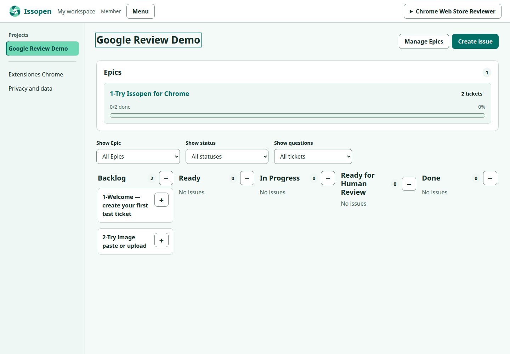
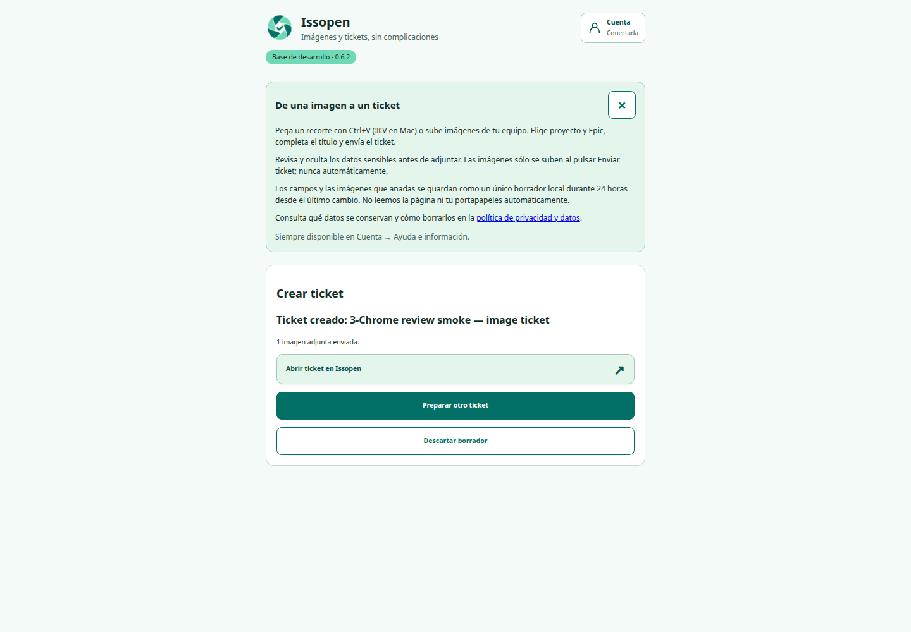

  

<h1 align="center">Issopen</h1>

  <strong>Turn every idea into work an AI agent can actually finish.</strong>

  The human-first issue tracker where your team, ChatGPT and coding agents
  plan, build, ask questions and ship from the same board.

  
  
  
  

  <a href="https://issopen.serviciosegado.com"><strong>Open Issopen</strong></a>
  ·
  <a href="https://issopen.serviciosegado.com/agent-onboarding"><strong>Connect an agent</strong></a>
  ·
  <a href="docs/self-hosting.md"><strong>Self-host</strong></a>
  ·
  <a href="CONTRIBUTING.md"><strong>Contribute</strong></a>

  

## Your issue tracker was built for people. Your next teammate isn't.

Ideas disappear in chats. Agents lose context. Humans copy requirements between
tools, then chase commits to find out what happened.

**Issopen turns every request into a shared, traceable contract.** Humans decide
what matters. Agents pick up structured work through MCP, ask when they are
blocked, link the result and return it for human review.

<strong>Idea → Ticket → Agent claims it → Questions stay visible → Code is linked → Human approves</strong>

No mystery prompts. No invisible progress. No “which chat had the latest
requirements?”

## One board. Two kinds of teammates.

| For humans | For AI agents |
| --- | --- |
| Capture ideas before they disappear | Discover only the projects and actions they are allowed to use |
| Organize work with projects, Epics and a visual board | Claim tickets without duplicating another agent's work |
| Answer blocking questions inside the ticket | Ask bounded questions with recommendations instead of guessing |
| See activity, comments, evidence and code results together | Report progress and attach branches, commits or pull requests |
| Keep the final say with human review | Continue independent work while one decision is blocked |

## From a screenshot to an actionable ticket in seconds

Paste a screenshot or upload images from Chrome, choose the project and Epic,
and create the ticket without breaking your flow. Images stay in a local draft
until you explicitly send them.

  

The extension is designed for visual QA, product feedback, audits and those
“this feels wrong” moments that are hard to describe without a picture.

## Give an Epic to Codex. Come back to reviewed work.

Issopen's MCP server and skill create a governed execution loop:

1. You define the outcome as an Epic and its tickets.
2. The agent inspects the backlog, claims work and verifies each result.
3. If a decision needs you, it leaves a visible warning and a focused question.
4. If the Epic is missing work, the agent can propose or create the necessary
   tickets.
5. Completed work comes back with traceable evidence for human review.

The agent does not get a magic admin key. Access is scoped by identity, project
and capability, and it can be revoked.

## Built for the work that falls between “idea” and “merged”

- **Product teams** turn feedback and screenshots into an actionable backlog.
- **Developers** let coding agents work without losing ownership of decisions.
- **Agencies** isolate projects, members and agent permissions per workspace.
- **Founders** keep product, code and AI execution in one visible loop.
- **Auditors and QA teams** preserve evidence, questions and decisions beside
  the ticket they belong to.

## What you get today

- A responsive project board with collapsible workflow columns.
- Epics with progress, filtering and archival.
- Rich tickets with comments, evidence, activity and code-result links.
- Blocking questions with recommendations, answer history and notifications.
- Human assignment, workspace membership and access auditing.
- Google sign-in and invitation-based private workspaces.
- A Chrome extension for image-first ticket capture.
- An MCP server and installable Codex skill for agent workflows.
- Self-hosted deployment with PostgreSQL and Docker.

## Start here

| I want to… | Go here |
| --- | --- |
| See the product | [Open the Issopen instance](https://issopen.serviciosegado.com) — access is invitation-based |
| Connect ChatGPT, Codex or another MCP client | [Agent and MCP onboarding](https://issopen.serviciosegado.com/agent-onboarding) |
| Run my own instance | [Self-hosting and operations](docs/self-hosting.md) |
| Understand the Chrome extension | [Chrome extension guide](docs/chrome-extension.md) |
| Review privacy and retention | [Privacy and data contract](docs/privacy.md) |
| Explore implementation notes | [Technical documentation](docs/) |
| Send a pull request | [Contribution guide](CONTRIBUTING.md) |

## Help build the issue tracker for agentic teams

Found a rough edge? Have a workflow that should be agent-native? Open an issue
or send a pull request. Code, documentation, UX feedback and reproducible bug
reports are all welcome.

[Read the contribution guide →](CONTRIBUTING.md)

## License and commercial use

Issopen is public **source-available software** under the
[PolyForm Noncommercial License 1.0.0](LICENSE.md). You may use, study, modify
and redistribute it for permitted noncommercial purposes.

Commercial use, a managed Issopen service and commercial licensing are reserved
for the project owner. Contact serviciosegado@gmail.com to discuss a commercial
deployment.
