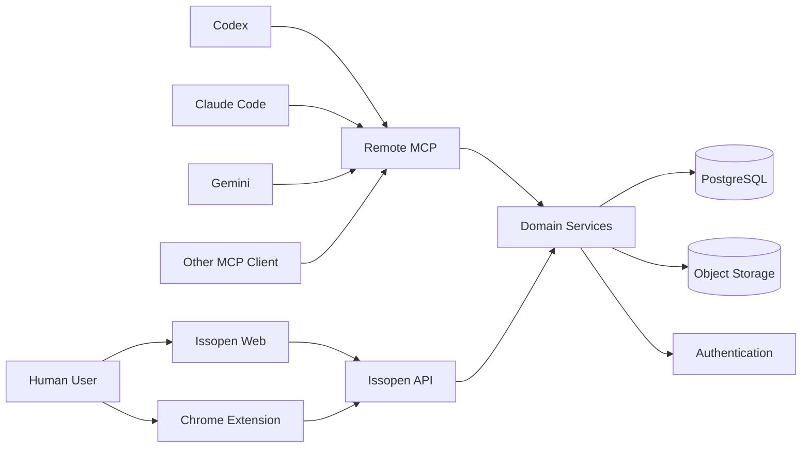
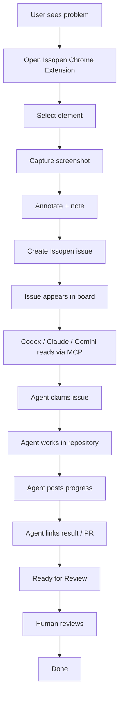

# Issopen — init-project.md

> **Issopen** is an open-source issue tracker built for humans and AI coding agents.
>
> This document is the initial product and architecture specification for Claude Code, Codex, Gemini CLI and GSD.
>
> Treat it as the primary source of truth when initializing the project.

---

# 1. Product vision

Issopen is a lightweight, open-source issue tracker designed around a simple workflow:

```text
Find a problem
    ↓
Capture it visually
    ↓
Create an issue
    ↓
Give the issue to a human or AI agent
    ↓
Work on it
    ↓
Review
    ↓
Done
```

Issopen combines:

- a simple Kanban issue tracker;
- a Chrome extension for reporting issues from any webpage;
- screenshots and visual annotations;
- page and DOM context attached to visual issues;
- a Remote MCP server;
- first-class support for Codex, Claude, Gemini and other MCP clients;
- human + AI-agent collaboration;
- GitHub/repository context;
- open-source self-hosting;
- a permanent Cloud Free tier;
- a paid Business tier focused on governance, security and scale.

The goal is **not** to rebuild Jira, Trello, Linear or ClickUp.

The goal is to build:

> **The open-source issue tracker for humans and AI agents.**

---

# 2. Core product thesis

A good bug report should already contain enough context to act as a useful prompt for a coding agent.

Traditional workflow:

```text
User sees bug
    ↓
Creates vague ticket
    ↓
Developer asks for details
    ↓
Developer reproduces bug
    ↓
Developer identifies UI/component
    ↓
Developer starts coding
```

Issopen workflow:

```text
User sees bug
    ↓
Issopen Chrome extension
    ↓
Select problematic element
    ↓
Screenshot + annotation + URL + DOM context
    ↓
Issue created
    ↓
Codex / Claude / Gemini reads issue through MCP
    ↓
Agent works on repository
    ↓
Agent comments / links PR / moves issue
    ↓
Human reviews
```

The ticket itself becomes **structured working context for an agent**.

---

# 3. Product positioning

## Primary positioning

> **Open-source issue tracking for humans and AI agents.**

## Secondary message

> Capture the problem. Give your agent the context. Ship the fix.

## What Issopen is

Issopen is:

- open source;
- self-hostable;
- developer-first;
- simple;
- issue-oriented;
- visual;
- MCP-native;
- agent-native;
- extensible through API/webhooks;
- usable without AI.

## What Issopen is NOT

Issopen is not:

- a Jira replacement;
- a generic enterprise project-management suite;
- a docs/wiki platform;
- a CRM;
- an AI wrapper;
- a hosted LLM gateway;
- a coding-agent provider;
- a low-code workflow builder;
- an all-in-one productivity suite.

---

# 4. Business model

Issopen uses an **open-core + hosted SaaS** strategy.

There are four conceptual editions.

---

## 4.1 Community / Self-hosted

Price:

```text
FREE
```

License target:

```text
AGPLv3
```

Core functionality should be available in the open-source version.

Self-hosted users should get:

- workspaces;
- projects;
- Kanban;
- issues;
- comments;
- labels;
- priorities;
- attachments;
- visual captures;
- Chrome extension;
- MCP;
- API;
- webhooks;
- basic GitHub integration;
- agent activity;
- Docker deployment.

The Community Edition must be genuinely useful.

Do not intentionally cripple it.

---

## 4.2 Issopen Cloud Free

Price:

```text
€0 forever
```

Target:

- individual developers;
- students;
- open-source maintainers;
- small teams;
- product evaluation.

Initial proposed limits:

- unlimited users;
- 1 workspace;
- 3 active projects;
- 250 active issues;
- 100 visual reports/month;
- 2 GB storage;
- MCP included;
- Chrome extension included;
- API included;
- basic GitHub integration included.

Exact limits are configuration, not product architecture.

They must be changeable centrally.

---

## 4.3 Issopen Business

Initial pricing hypothesis:

```text
€59–€99 / workspace / month
```

Business monetizes:

- governance;
- higher limits;
- security;
- advanced agent controls;
- audit;
- permissions;
- automation;
- organization features.

Potential Business features:

- unlimited or high project limits;
- higher issue limits;
- 50+ GB storage;
- private projects;
- teams;
- custom roles;
- advanced permissions;
- audit log;
- SSO;
- custom retention;
- analytics;
- custom workflows;
- advanced GitHub/GitLab integration;
- agent identities;
- agent permissions;
- agent activity dashboards;
- automatic routing;
- approval gates;
- support.

Business should not simply be:

> Free, but with more tickets.

---

## 4.4 Enterprise

Not part of MVP.

Possible future features:

- SAML;
- SCIM;
- data residency;
- custom compliance;
- custom retention;
- private cloud;
- dedicated support;
- advanced security policies;
- enterprise contracts.

Do not implement Enterprise before real demand.

---

# 5. Critical business decision

## MCP is FREE

Basic MCP must be available in:

- Community;
- Cloud Free;
- Business.

Do not put basic MCP behind a paywall.

MCP is part of the adoption loop.

The user pays their own AI provider.

Issopen does not pay for normal inference.

Conceptually:

```text
Codex ──────┐
Claude ─────┤
Gemini ─────┼──── MCP ────> Issopen
Cursor ─────┤
Others ─────┘
```

The user consumes their own:

- OpenAI subscription/API;
- Anthropic subscription/API;
- Gemini subscription/API;
- Cursor subscription;
- other agent/runtime.

Issopen provides context and coordination.

---

# 6. Product principles

## 6.1 Simple first

If something can be solved with:

```text
issue
comment
status
attachment
```

do not introduce a complex workflow engine.

---

## 6.2 Agent-first, not AI-everywhere

AI should exist where it improves the workflow.

Do not add AI buttons everywhere just for marketing.

---

## 6.3 Humans remain first-class

Issopen must remain an excellent simple issue tracker even without an AI agent.

---

## 6.4 Agents are first-class actors

Agent activity must be visible and attributable.

Example:

```text
10:32 Luis created ISSUE-142
10:35 Codex claimed ISSUE-142
10:41 Codex added investigation notes
10:52 Codex linked PR #812
10:53 Codex moved issue to Ready for Review
11:04 Ana moved issue to Done
```

---

## 6.5 Browser context is a major differentiator

Issopen must make:

```text
webpage
    ↓
visual problem
    ↓
structured issue
```

extremely easy.

---

# 7. Main user personas

## Developer

Wants:

- clear issue context;
- repository context;
- easy MCP connection;
- ability to use Codex/Claude/Gemini;
- fewer clarification loops;
- fast issue → code workflow.

---

## Product manager / founder

Wants:

- simple board;
- prioritization;
- screenshots;
- annotations;
- assignment;
- visibility of human and agent progress.

---

## Designer

Wants:

- click broken UI;
- annotate;
- describe expected result;
- avoid technical developer tools.

---

## QA / tester

Wants:

- reproducible visual issue reports;
- browser context;
- URL;
- element context;
- screenshots;
- status tracking.

---

## Coding agent

Needs:

- structured issue retrieval;
- attachments;
- project/repository metadata;
- comments;
- issue status updates;
- ability to claim work;
- ability to attach/link results;
- clear permissions.

---

# 8. Core entities

Initial domain model:

```text
User
Workspace
WorkspaceMember

Project
BoardColumn

Issue
Comment
Label
IssueLabel

Attachment
VisualCapture

ApiToken
UsageCounter
AuditEvent
```

Future:

```text
AgentIdentity
AgentPermission
AutomationRule
Integration
Repository
PullRequest
Team
CustomField
BillingSubscription
```

Do not create future tables before they are needed.

---

# 9. Core issue workflow

Initial semantic states:

```text
Backlog
Todo
In Progress
Ready for Review
Done
```

Database board columns must separate:

```text
display name
```

from:

```text
semantic category
```

Example:

```text
"Codex Working" -> in_progress
"QA"            -> review
"Shipped"       -> done
```

This lets users rename columns without breaking agent logic.

---

# 10. Main web application

The web application should initially contain:

```text
Login
Onboarding

Workspace
Projects

Project board
Issue detail

Workspace settings
MCP/API settings
```

Later:

```text
Members
Agents
Integrations
Billing
Analytics
Business settings
```

---

# 11. Kanban board

Initial view:

```text
┌──────────┬──────────┬──────────────┬──────────────────┬──────────┐
│ Backlog  │ Todo     │ In Progress  │ Ready for Review │ Done     │
├──────────┼──────────┼──────────────┼──────────────────┼──────────┤
│ ISS-101  │ ISS-104  │ 🤖 ISS-108   │ ISS-096          │ ISS-090  │
│ ISS-102  │ ISS-105  │              │                  │          │
└──────────┴──────────┴──────────────┴──────────────────┴──────────┘
```

Issue cards initially show:

- issue identifier;
- title;
- priority;
- assignee;
- labels;
- visual-report icon;
- comments count where useful.

Do not overload cards.

---

# 12. Issue detail

Example:

```text
ISS-142

Checkout button overlaps payment selector

[In Progress] [High] [🤖 Codex]

Description
--------------------------------------------------

The submit button overlaps the payment method selector.

Visual context
--------------------------------------------------

[screenshot]

Page:
https://example.com/checkout

Selected element:
button.submit-order

DOM:
<button class="submit-order"...>

Viewport:
1440 × 900

Activity
--------------------------------------------------

Luis
Created issue.

Codex
Investigating layout styles.

Codex
Root cause appears to be incorrect flex wrapping.

Codex
PR #182 attached.

Status → Ready for Review
```

Technical capture information should be collapsible.

---

# 13. Manual issue creation

Users can create issues without the extension.

Initial fields:

- title;
- description;
- project;
- priority;
- status;
- assignee;
- labels;
- attachments.

Defaults should make creation fast.

---

# 14. Chrome extension

Chrome is the only browser target for MVP.

The extension is a key differentiator.

Ideal flow:

```text
1. Open webpage
2. Click Issopen extension
3. Click "Report issue"
4. Select element OR report full page
5. Capture screenshot
6. Annotate
7. Write short note
8. Choose project
9. Submit
```

The issue appears immediately in Issopen.

---

# 15. Chrome extension data

Automatically capture where safe:

- URL;
- page title;
- screenshot;
- timestamp;
- viewport width;
- viewport height;
- scroll position;
- browser;
- OS where safely available;
- selected element tag;
- selected element identifier;
- selected element bounding box;
- limited visible text;
- stable selector;
- sanitized DOM excerpt.

Later:

- console errors;
- network errors;
- session context.

Do not capture network or console data in the first extension milestone.

---

# 16. Element picker

The page selection UX should behave like browser inspection tools, but simpler.

Flow:

```text
hover element
    ↓
highlight
    ↓
click
    ↓
freeze selection
```

Keys:

```text
Escape -> cancel
```

Store:

- bounding rectangle;
- tag;
- useful attributes;
- selector;
- visible text excerpt;
- sanitized nearby DOM.

---

# 17. Selector strategy

Prefer selectors in this order:

1. `data-testid`;
2. unique ID;
3. stable semantic attribute;
4. aria/role based locator;
5. short CSS path.

Avoid:

- giant brittle selectors;
- full DOM paths;
- nth-child chains unless unavoidable.

The selector is helpful context, not guaranteed permanent identity.

---

# 18. Screenshot annotations

Initial annotation tools:

- rectangle;
- arrow;
- pen/freehand;
- short text.

Optional if easy:

- blur/redaction.

Do not build a full graphic editor.

Store:

- original screenshot;
- annotation data separately.

Prefer normalized coordinates.

Example:

```json
{
  "type": "rect",
  "x": 0.42,
  "y": 0.31,
  "width": 0.18,
  "height": 0.08
}
```

---

# 19. Privacy rules for browser capture

Never capture by default:

- passwords;
- password values;
- authentication cookies;
- session cookies;
- authorization headers;
- credit-card values;
- sensitive form fields;
- localStorage;
- sessionStorage;
- hidden tokens;
- full raw DOM.

DOM snippets must be sanitized.

Remove:

- scripts;
- style contents;
- hidden inputs;
- input values;
- tokens;
- credentials;
- excessive text.

---

# 20. MCP strategy

Issopen exposes one standards-compatible Remote MCP server.

Do not create:

```text
Codex MCP
Claude MCP
Gemini MCP
```

Create:

```text
Issopen MCP
```

and let compatible clients connect to it.

---

# 21. Initial MCP tools

The MVP tool surface should remain small and explicit.

## `list_workspaces`

Returns available workspaces.

---

## `list_projects`

Filters by workspace.

---

## `list_issues`

Possible filters:

```text
workspace
project
status
assignee
priority
label
query
limit
cursor
```

---

## `get_issue`

Returns:

```text
issue
project
status
description
labels
assignee
comments
visual context
attachment metadata
repository metadata
```

---

## `create_issue`

Available if token scope permits.

---

## `update_issue`

Only explicit supported fields.

Do not expose arbitrary database patching.

---

## `add_comment`

Allows agents to report:

- investigation;
- progress;
- result;
- blockers.

---

## `claim_issue`

Allows an agent to signal it is taking ownership of work.

---

## `transition_issue`

Moves issue between semantic statuses / board columns.

---

## `get_attachment`

Returns metadata plus authorized short-lived access.

Never dump large image base64 into normal MCP responses.

---

# 22. MCP authentication

MVP:

```text
API / MCP personal tokens
```

User flow:

```text
Settings
    ↓
Developer / MCP
    ↓
Create token
    ↓
Token displayed once
    ↓
Configure Codex/Claude/Gemini
```

Tokens:

- stored hashed;
- revocable;
- have last-used timestamp;
- optionally expire;
- have scopes.

Initial scopes:

```text
projects:read
issues:read
issues:write
comments:write
attachments:read
```

Later:

```text
OAuth for Remote MCP
```

Do not block MVP on building a full OAuth authorization server.

---

# 23. Agents as actors

MVP can identify activity using:

```text
human
api
agent
integration
system
```

Later introduce explicit:

```text
AgentIdentity
```

Example:

```text
Codex Frontend
Claude Reviewer
Gemini QA
```

Future UI:

```text
Members

👤 Luis
👤 María

Agents

🤖 Codex Frontend
🤖 Claude Reviewer
🤖 Gemini QA
```

---

# 24. Business agent controls

A major Business differentiator.

Future example:

```text
Agent: Codex Frontend

Read issues               ✅
Claim issues              ✅
Comment                   ✅
Change status             ✅
Create issues             ✅
Mark Done                 ❌

Projects:
frontend                   ✅
backend                    ❌
infrastructure             ❌

Maximum active issues:
2

Require human review:
✅
```

Other Business features:

- agent audit trail;
- project allowlists;
- repository allowlists;
- concurrency limits;
- approval gates;
- routing rules;
- activity analytics.

---

# 25. GitHub integration

GitHub is the first repository integration.

## MVP-light

Project can store:

```text
repository_url
```

Issue/MCP context includes repository URL.

Allow manual:

```text
PR URL
commit URL
branch
```

---

## Later

Build GitHub App integration for:

- repository selection;
- PR linking;
- automatic status;
- branch relation;
- webhooks;
- authentication;
- issue-to-PR relation.

Do not make the GitHub App a blocker for the first MVP.

---

# 26. Future verification workflow

Strategic future differentiator:

```text
Issue created with screenshot
        ↓
Agent fixes code
        ↓
Agent launches app/browser
        ↓
Agent reproduces fixed UI
        ↓
New screenshot
        ↓
BEFORE vs AFTER
        ↓
Ready for Review
```

Not required for initial MVP.

---

# 27. Open-source strategy

Core should live publicly on GitHub.

Suggested repository:

```text
issopen/issopen
```

Potential license:

```text
AGPLv3
```

Goals:

- developers can inspect the code;
- developers can self-host;
- ecosystem can contribute;
- integrations can grow;
- open source becomes an acquisition channel.

Potential future rule:

> Public open-source repositories receive generous free Cloud usage.

Not needed in MVP.

---

# 28. Monorepo architecture

Use:

- TypeScript;
- pnpm;
- Turborepo.

Recommended:

```text
issopen/
│
├── apps/
│   ├── web/
│   ├── api/
│   └── extension/
│
├── packages/
│   ├── db/
│   ├── contracts/
│   ├── auth/
│   ├── ui/
│   ├── shared/
│   └── mcp/
│
├── docs/
│
├── .planning/
│
├── AGENTS.md
├── CLAUDE.md
├── init-project.md
├── docker-compose.yml
├── package.json
├── pnpm-workspace.yaml
└── turbo.json
```

Do not create packages merely because they appear in this diagram.

Only extract a package if it has a real shared responsibility.

---

# 29. Recommended technology stack

## Language

```text
TypeScript
```

Use it across:

- web;
- extension;
- backend;
- MCP;
- shared contracts.

---

## Web

Recommended:

- Next.js;
- React;
- Tailwind CSS;
- shadcn/ui.

Do not build a bespoke design system initially.

---

## Extension

Recommended:

- WXT;
- React;
- TypeScript;
- Manifest V3.

Chrome only for MVP.

---

## API

Recommended:

- Hono;
- Node.js-compatible runtime.

One backend deployment initially.

MCP should live in the same backend deployment during MVP.

Do not create microservices.

---

## Database

```text
PostgreSQL
```

Recommended managed MVP:

```text
Supabase PostgreSQL
```

---

## ORM

Recommended:

```text
Drizzle ORM
```

All schema changes must use migrations.

---

## Authentication

Recommended:

```text
Supabase Auth
```

Initial:

- email;
- GitHub OAuth if straightforward.

---

## Storage

Recommended:

```text
Supabase Storage
```

Store:

- screenshots;
- images;
- attachments;
- future videos.

Never store large images as database blobs.

---

# 30. Shared contracts

Use Zod.

Package:

```text
packages/contracts
```

Example schemas:

```text
CreateWorkspaceInput
CreateProjectInput
CreateIssueInput
UpdateIssueInput

CreateCommentInput
CreateVisualCaptureInput

IssueDto
ProjectDto
WorkspaceDto

McpIssueContext
```

Do not independently duplicate DTOs between:

- web;
- extension;
- API;
- MCP.

---

# 31. Initial database model

## users

Managed by auth provider where practical.

---

## workspaces

```text
id
name
slug
created_by
plan
created_at
updated_at
```

---

## workspace_members

```text
workspace_id
user_id
role
created_at
```

Initial roles:

```text
owner
admin
member
```

---

## projects

```text
id
workspace_id
name
key
description
repository_url nullable
archived_at nullable
created_by
created_at
updated_at
```

Example issue IDs:

```text
WEB-142
API-18
APP-91
```

---

## board_columns

```text
id
project_id
name
semantic_category
position
created_at
updated_at
```

---

## issues

```text
id
workspace_id
project_id
number
title
description
column_id
priority
assignee_user_id nullable
source
created_by
created_at
updated_at
closed_at nullable
```

Possible sources:

```text
web
extension
api
mcp
integration
```

---

## comments

```text
id
issue_id
author_user_id nullable
actor_type
actor_identifier nullable
body
created_at
updated_at
```

---

## labels

```text
id
workspace_id
name
created_at
```

---

## issue_labels

```text
issue_id
label_id
```

---

## attachments

```text
id
workspace_id
issue_id
storage_key
filename
mime_type
size_bytes
kind
created_by
created_at
```

Kinds:

```text
screenshot
annotated_screenshot
image
document
video
other
```

---

## visual_captures

```text
id
issue_id
screenshot_attachment_id
page_url
page_title

viewport_width
viewport_height
scroll_x
scroll_y

browser_name
browser_version
os_name

selected_selector
selected_tag
selected_text_excerpt
selected_rect_json
sanitized_dom_snippet

annotation_json

created_at
```

---

## api_tokens

```text
id
workspace_id
user_id
name
token_hash
scopes
last_used_at
expires_at nullable
revoked_at nullable
created_at
```

Never store plaintext API tokens after issuance.

---

## audit_events

```text
id
workspace_id
actor_type
actor_id nullable
action
entity_type
entity_id
metadata_json
created_at
```

Do not build event sourcing.

PostgreSQL remains the state source.

---

# 32. API architecture

Web, extension and MCP should call the same domain layer.

```text
Web ─────────────┐
Extension ───────┼────> Domain services ────> PostgreSQL
MCP ─────────────┤                │
Integrations ────┘                └─────────> Object Storage
```

Business logic belongs server-side.

Examples:

- authorization;
- quotas;
- numbering;
- transitions;
- signed file access;
- audit events.

---

# 33. Authorization

Every workspace-scoped request must check authorization.

Never trust a supplied:

```text
workspace_id
project_id
issue_id
```

without verifying ownership/access.

At minimum:

```text
actor
  ↓
workspace membership
  ↓
project permission
  ↓
resource access
```

Frontend visibility is not authorization.

---

# 34. Attachment security

Files must be private by default.

Use:

- signed upload;
- signed read URLs;
- MIME validation;
- size limits;
- workspace quota checks.

Do not permit arbitrary executable hosting.

---

# 35. Free-plan limits

Centralize plan configuration.

Example:

```ts
FREE_PLAN = {
  activeProjects: 3,
  activeIssues: 250,
  visualReportsPerMonth: 100,
  storageBytes: 2 * GB,
}
```

Do not scatter these values through UI components.

The API is authoritative.

---

# 36. Free-plan behavior at limits

Never lock users out of existing data.

If project limit reached:

```text
Existing projects readable
New project blocked
Archiving permitted
```

If screenshot quota reached:

```text
Existing captures readable
Manual text issue creation still works
New capture blocked
```

If storage reached:

```text
Issues/comments still work
New attachment blocked
```

---

# 37. Self-hosting

Community deployment should eventually be:

```bash
docker compose up
```

Initial Docker setup should support:

```text
web
api
postgres
object storage / compatible storage
```

If Supabase is tightly used during early development, self-host deployment can be finalized after the primary SaaS MVP flow works.

Do not delay the first vertical slice attempting to perfect every self-hosting topology.

---

# 38. Observability

MVP:

- structured logs;
- request IDs;
- error tracking;
- API errors;
- MCP authentication failures;
- MCP tool failures;
- extension submission failures;
- upload failures.

Do not build custom observability infrastructure.

---

# 39. Product analytics

Important funnel:

```text
signup
   ↓
workspace created
   ↓
project created
   ↓
first issue
   ↓
extension installed
   ↓
first visual report
   ↓
MCP connected
   ↓
first MCP read
   ↓
first MCP write
```

The strongest activation event:

> A user submits a visual issue and an AI agent reads or updates it.

---

# 40. MVP scope

The MVP succeeds when this works end-to-end:

```text
User creates account
        ↓
Creates project
        ↓
Sees Kanban board
        ↓
Installs Chrome extension
        ↓
Captures visual issue
        ↓
Issue appears with screenshot/page/DOM context
        ↓
Connects Codex/Claude/Gemini via MCP
        ↓
Agent reads issue
        ↓
Agent comments
        ↓
Agent changes status
        ↓
Human reviews
        ↓
Done
```

Everything else is secondary.

---

# 41. Explicit MVP non-goals

DO NOT implement yet:

- Jira parity;
- Scrum;
- sprint planning;
- Gantt;
- docs/wiki;
- CRM;
- calendar;
- time tracking;
- billing/invoicing;
- native mobile apps;
- native desktop app;
- Firefox extension;
- Safari extension;
- full session replay;
- full network capture;
- full console capture;
- custom LLM;
- hosted coding-agent runtime;
- automatic deployments;
- enterprise compliance;
- SAML;
- SCIM;
- multi-region;
- Kubernetes;
- microservices;
- complex custom fields;
- full automation builder.

---

# 42. Development philosophy

Optimize for:

```text
small vertical slices
```

not:

```text
large horizontal architecture projects
```

Good milestone:

> User creates project and persistent issue.

Bad milestone:

> Build database subsystem.

Every development phase should leave a runnable product.

---

# 43. Testing strategy

Do not chase arbitrary test coverage.

Prioritize critical integration paths.

## Must test

- authentication;
- workspace isolation;
- project creation;
- issue creation;
- status transitions;
- file authorization;
- extension report submission;
- MCP authentication;
- MCP issue read;
- MCP issue write;
- cross-workspace access denial.

## Unit tests where valuable

- quotas;
- authorization helpers;
- token scopes;
- DOM sanitization;
- selector logic;
- status semantics.

## Visual/manual verification

Each UI milestone must be launched and inspected in a real browser.

Chrome extension milestones must be tested on real webpages.

MCP milestones must be tested with real supported MCP clients.

---

# 44. Initial roadmap

Use GSD to turn this roadmap into proper requirements and executable plans.

---

## Phase 0 — Repository foundation

Goal:

> Issopen can be installed and run locally.

Deliver:

- pnpm;
- Turborepo;
- apps/web;
- apps/api;
- apps/extension;
- packages/contracts;
- packages/db;
- lint;
- typecheck;
- environment configuration;
- root scripts;
- initial README;
- Docker baseline where reasonable.

Acceptance:

```text
pnpm install
pnpm dev
```

starts a usable development environment.

Web loads.

API health endpoint works.

Extension builds.

---

## Phase 1 — Authentication and workspace

Goal:

> A user can authenticate and enter an isolated workspace.

Deliver:

- signup;
- login;
- logout;
- sessions;
- workspace creation;
- workspace membership;
- onboarding;
- authorization foundation.

Acceptance:

- account A cannot read workspace B;
- refresh preserves session.

---

## Phase 2 — Projects and Kanban

Goal:

> Issopen works as a simple issue tracker.

Deliver:

- project creation;
- default board columns;
- issue identifiers;
- create issue;
- edit issue;
- drag/drop;
- priority;
- labels;
- comments;
- issue detail.

Acceptance:

```text
create project
create issue
move issue
comment
refresh
```

all persist.

---

## Phase 3 — Private attachments

Goal:

> Issues can securely contain screenshots and images.

Deliver:

- object storage;
- signed upload;
- signed read;
- attachment metadata;
- basic storage quotas.

Acceptance:

- upload image;
- image appears in issue;
- unauthorized workspace cannot access it.

---

## Phase 4 — Chrome extension basic capture

Goal:

> A user can report the current webpage directly to Issopen.

Deliver:

- extension authentication;
- current URL;
- page title;
- screenshot;
- note;
- project selection;
- issue creation.

Acceptance:

```text
open webpage
click extension
capture
submit
```

issue appears in board.

This is the first major product demo milestone.

---

## Phase 5 — Element selection

Goal:

> A visual issue points directly to the broken UI element.

Deliver:

- hover highlight;
- click selection;
- stable selector;
- bounding box;
- sanitized DOM;
- selected text excerpt.

Acceptance:

Issue contains useful element context without exposing sensitive values.

---

## Phase 6 — Screenshot annotations

Goal:

> Reporter can visually explain the issue.

Deliver:

- rectangle;
- arrow;
- pen;
- text;
- annotation persistence.

Acceptance:

Annotations appear correctly on issue screenshot.

---

## Phase 7 — MCP read

Goal:

> External AI coding agents can read Issopen.

Deliver:

- API token settings;
- token hashing;
- scopes;
- Remote MCP endpoint;
- list projects;
- list issues;
- get issue;
- attachment access.

Acceptance:

At least two real MCP clients can connect and inspect a visual issue.

Suggested verification clients:

- Codex;
- Claude Code;

then Gemini if convenient.

---

## Phase 8 — MCP write

Goal:

> AI agents can participate in the workflow.

Deliver:

- add comment;
- update issue;
- claim issue;
- transition issue;
- actor attribution;
- audit event.

Acceptance:

Agent:

```text
reads issue
marks In Progress
posts comment
marks Ready for Review
```

and activity appears correctly in UI.

This completes the core Issopen thesis.

---

## Phase 9 — Free Cloud limits

Goal:

> Cloud Free can operate sustainably.

Deliver:

- plan config;
- project quota;
- issue quota;
- capture quota;
- storage quota;
- usage display;
- graceful limit states.

---

## Phase 10 — Repository context

Goal:

> Issues can carry repository/PR information.

Deliver:

- project repository URL;
- repository visible in issue;
- repository available through MCP;
- attach PR URL;
- attach branch/commit metadata.

---

## Phase 11 — Public beta

Goal:

> Issopen can be used safely by external users.

Deliver:

- onboarding polish;
- Chrome Web Store package;
- MCP setup docs;
- Codex setup docs;
- Claude setup docs;
- Gemini setup docs;
- rate limits;
- error monitoring;
- basic product analytics;
- backup strategy;
- security review;
- privacy copy.

---

## Phase 12 — Self-hosted Community release

Goal:

> Developers can run Issopen themselves.

Deliver:

- Docker Compose;
- documented environment;
- migrations;
- storage configuration;
- self-host docs;
- release process.

---

## Phase 13 — Business foundation

Only after usage validates the product.

Candidate features:

- billing;
- higher limits;
- private projects;
- advanced roles;
- audit UI;
- agent permissions;
- teams;
- advanced retention.

Do not implement the complete Business vision in one phase.

---

# 45. GSD workflow

Use GSD for project planning and implementation.

Expected loop:

```text
Discuss
    ↓
Plan
    ↓
Execute
    ↓
Verify
    ↓
Ship
```

Store execution memory under:

```text
.planning/
```

Typical artifacts:

```text
PROJECT.md
REQUIREMENTS.md
ROADMAP.md
STATE.md

phases/
  phase-N/
    CONTEXT.md
    PLAN.md
    SUMMARY.md
    VERIFICATION.md
```

`init-project.md` defines the original product intent.

`.planning/` defines current execution state.

---

# 46. Source-of-truth order

When instructions conflict:

1. Current explicit product-owner instruction.
2. Current GSD phase context.
3. GSD requirements/roadmap.
4. This `init-project.md`.
5. Existing project conventions.
6. Agent preference.

Claude/Codex must not override product decisions because they prefer another architecture.

---

# 47. AI coding-agent rules

## Read before coding

Before meaningful work:

```text
init-project.md
AGENTS.md
current .planning files
relevant package docs
```

---

## Do not silently redesign

If a plan conflicts with a locked product decision:

- document the conflict;
- propose a solution;
- do not silently change the product.

---

## Avoid broad refactors

Do not refactor unrelated working code.

---

## Do not add scope

Interesting future ideas go into backlog/planning.

Do not add them to the current phase automatically.

---

## Keep the product runnable

After each phase:

```text
pnpm dev
```

should still launch the project.

---

## Never fake completion

MCP is not complete because a mocked handler exists.

Chrome capture is not complete because a static image uploads.

Auth is not complete because a user ID is hardcoded.

Acceptance criteria require real behavior.

---

# 48. Architecture diagram



For MVP:

```text
API + MCP + Domain
```

may be one deployable backend.

---

# 49. Primary product loop



---

# 50. Cost-control rules

Free Forever depends on low variable costs.

Major cost drivers:

- screenshots;
- bandwidth;
- database;
- storage;
- logs;
- future video;
- future browser automation;
- future hosted agents.

Therefore:

- compress screenshots;
- use object storage;
- enforce quotas;
- avoid unlimited video;
- avoid proxying LLM inference;
- rate-limit abusive MCP/API use;
- use lifecycle policies where useful.

---

# 51. Security baseline

Before public beta:

- hash API tokens;
- private storage;
- signed attachment URLs;
- server-side authorization;
- input validation;
- secure session cookies;
- upload limits;
- MIME validation;
- rate limiting;
- no secrets in logs;
- extension privacy checks;
- DOM sanitization;
- dependency scanning.

Basic security is required even in the open-source MVP.

Enterprise compliance is not.

---

# 52. Anti-overengineering rules

Do not introduce early:

- Kubernetes;
- Kafka;
- RabbitMQ;
- event sourcing;
- CQRS;
- GraphQL without a real need;
- microservices;
- custom authentication;
- custom storage infrastructure;
- vector databases;
- LLM gateways;
- custom billing;
- complex workflow engines;
- massive design systems.

Use managed/simple infrastructure until real scale forces change.

---

# 53. Naming conventions

Product:

```text
Issopen
```

Repository:

```text
issopen
```

Main domain language:

```text
Workspace
Project
Issue
BoardColumn
Comment
Attachment
VisualCapture
Agent
```

Prefer:

```text
Issue
```

internally rather than mixing:

```text
Ticket
Task
Card
Issue
```

UI wording may evolve later.

---

# 54. Suggested initial repository

```text
issopen/
│
├── apps/
│   ├── web/
│   ├── api/
│   └── extension/
│
├── packages/
│   ├── contracts/
│   ├── db/
│   ├── auth/
│   ├── shared/
│   └── ui/
│
├── docs/
│
├── .planning/
│
├── AGENTS.md
├── CLAUDE.md
├── init-project.md
├── README.md
├── LICENSE
├── docker-compose.yml
├── .env.example
├── package.json
├── pnpm-workspace.yaml
└── turbo.json
```

---

# 55. Root developer scripts

Aim for:

```bash
pnpm install

pnpm dev
pnpm dev:web
pnpm dev:api
pnpm dev:extension

pnpm build
pnpm lint
pnpm typecheck
pnpm test
```

Do not make normal development require memorizing many package-specific commands.

---

# 56. Definition of MVP success

The MVP is successful when this demo works without mocks:

### 1. Reporter

```text
opens website
selects broken element
takes screenshot
adds annotation
creates issue
```

### 2. Issopen

```text
creates ISS-142
stores screenshot
stores safe page context
shows issue in Kanban
```

### 3. Agent

```text
connects through MCP
reads ISS-142
retrieves context
claims it
moves it In Progress
adds comments
links result
moves Ready for Review
```

### 4. Human

```text
reviews result
marks Done
```

If that flow works smoothly, Issopen has validated its core thesis.

---

# 57. Initial GSD initialization prompt

After creating the repository and placing this file at:

```text
/init-project.md
```

initialize GSD and use a prompt equivalent to:

```text
We are starting Issopen as a greenfield project.

Read init-project.md completely before making product or architectural decisions.

Issopen is an open-source issue tracker for humans and AI coding agents.

The core product must remain simple.

The first end-to-end target is:

1. User can authenticate.
2. User can create a workspace and project.
3. User can create/manage issues on a Kanban board.
4. A Chrome extension can report a visual issue with screenshot, URL and selected DOM-element context.
5. Codex, Claude or Gemini can connect through Remote MCP.
6. The agent can read the issue, comment and transition it through the workflow.
7. Human can review and close the issue.

Preserve these product decisions:

- open source / self-hostable;
- Cloud Free forever;
- paid Business tier later;
- MCP is free;
- external AI providers are BYO-AI;
- TypeScript end-to-end;
- simple monorepo;
- no microservices;
- no Jira feature parity;
- no hosted coding-agent runtime in MVP;
- no enterprise scope in MVP.

Use init-project.md as the seed for:

- PROJECT.md;
- REQUIREMENTS.md;
- ROADMAP.md;
- initial phases.

Prefer small vertical phases that leave the application runnable.

Before coding, show the derived requirements and roadmap and identify any real technical conflicts.
```

---

# 58. First execution objective

Do not start by building the extension or MCP.

Build in this order:

```text
1. Repository
2. Authentication
3. Workspace
4. Projects
5. Issues/Kanban
6. Attachments
7. Chrome capture
8. DOM selection
9. Annotations
10. MCP read
11. MCP write
12. Free limits
13. GitHub context
14. Self-hosted release
15. Business
```

The shortest path to product validation is:

```text
KANBAN
   ↓
VISUAL CAPTURE
   ↓
ISSUE CONTEXT
   ↓
MCP
   ↓
AI AGENT
   ↓
HUMAN REVIEW
```

---

# 59. Final project rule

Whenever a new feature is proposed, ask:

> Does this make it easier to capture an issue, give useful context to a human/agent, coordinate work, or safely operate Issopen?

If the answer is no, it probably does not belong in the early product.

Issopen should win by being:

```text
OPEN
SIMPLE
VISUAL
AGENT-NATIVE
```

not by having the longest feature list.
