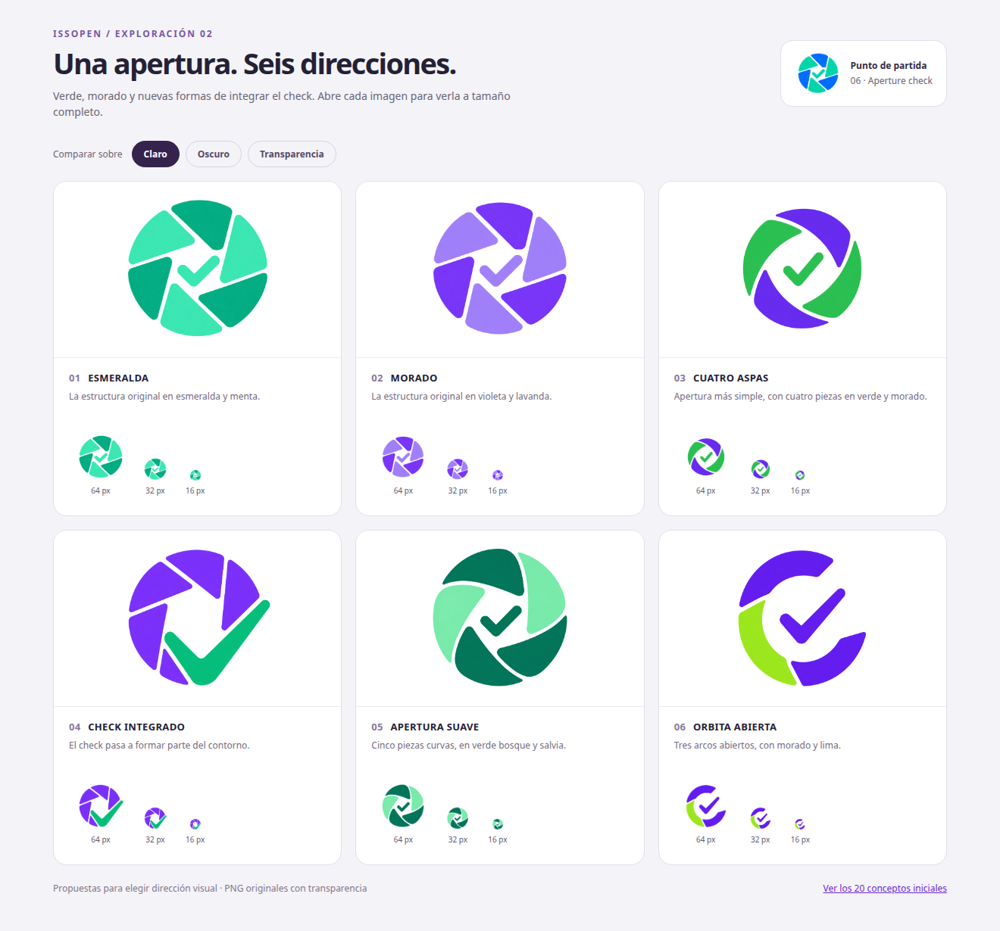

# Issopen · Variantes de aperture-check

Seis propuestas a partir del [concepto 06](../issopen-icon-06-aperture-check.png),
explorando verde, morado y cambios de estructura.

Abre [gallery.html](./gallery.html) para comparar los seis iconos sobre fondo
claro, oscuro o damero, con muestras a 64, 32 y 16 píxeles. Pulsa un icono para
abrir su PNG completo.

| Variante | Dirección | PNG |
| --- | --- | --- |
| ESMERALDA | La estructura original en esmeralda y menta. | [01-esmeralda](./issopen-aperture-01-esmeralda.png) |
| MORADO | La estructura original en violeta y lavanda. | [02-morado](./issopen-aperture-02-morado.png) |
| CUATRO ASPAS | Apertura más simple, con cuatro piezas en verde y morado. | [03-cuatro-aspas](./issopen-aperture-03-cuatro-aspas.png) |
| CHECK INTEGRADO | El check pasa a formar parte del contorno. | [04-check-integrado](./issopen-aperture-04-check-integrado.png) |
| APERTURA SUAVE | Cinco piezas curvas, en verde bosque y salvia. | [05-apertura-suave](./issopen-aperture-05-apertura-suave.png) |
| ORBITA ABIERTA | Tres arcos abiertos, con morado y lima. | [06-orbita-abierta](./issopen-aperture-06-orbita-abierta.png) |

## Refinamiento 07 · Seis piezas en verde bosque y menta

La [variante 07](./issopen-aperture-07-seis-piezas-verde-bosque.png) conserva la
paleta y el check oscuro de la apertura suave (05), con seis piezas curvas:
tres verdes oscuras y tres menta, alternadas. La versión de cinco piezas se
conserva para comparar. [Prompts de esta edición](./issopen-aperture-07-prompts.json).

La variante 07 fue aprobada el 2026-09-07 como identidad de Issopen y se usa,
sin modificar su imagen, en el logo y favicon a través de la copia canónica
[`issopen-icon-v1.png`](../../issopen-icon-v1.png). El resto se conserva como
exploración; la galería compara las seis propuestas iniciales.

## Generación

Herramienta integrada `image_gen`, con una petición independiente por variante
y el PNG original como referencia. Los prompts exactos se conservan en
[prompts.json](./prompts.json). Los valores hexadecimales son objetivos del
brief. Tras aprobar la variante 07, la paleta de la web se normalizó a verde
bosque `#027067` y menta `#6FD9B5`, muestreados de esa imagen; sus variaciones
raster se conservan en el icono.

Las variantes 03–06 recibieron una segunda edición de extracción de fondo
mediante la misma herramienta para sustituir el damero dibujado por alpha real.
La variante 01 recibió además una reparación de una mancha interior. Se
conservan los PNG finales sin recolorearlos, vectorizarlos o reescalarlos
mediante código. La comparativa es una captura de la galería en Chromium.
